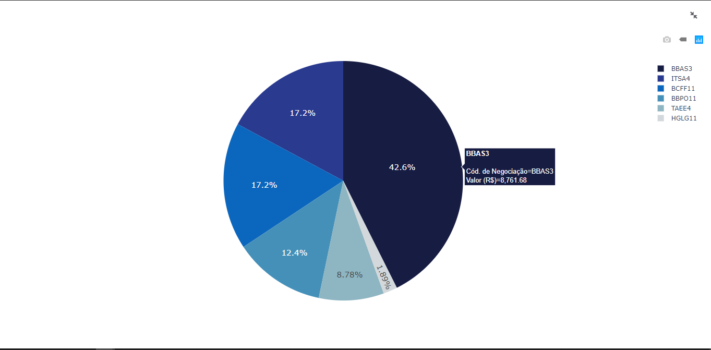
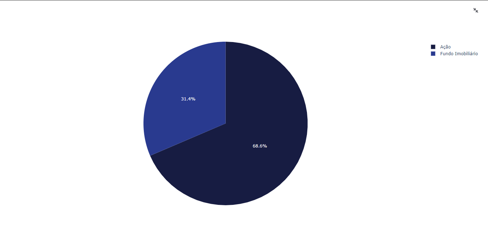
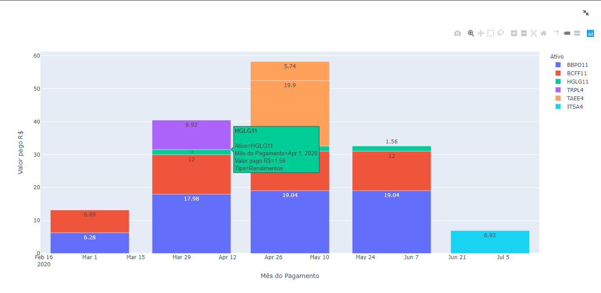
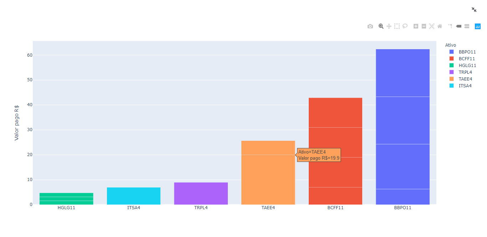
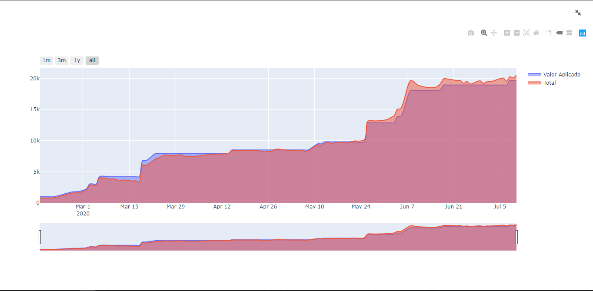
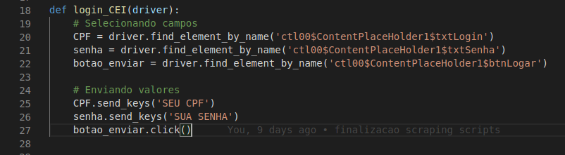

  

# NOTICE:
    Documentation out of date, will update once new version with MySQL is complete.

# Investment portfolio dashboard
To have a better understanding of the situation of my investments and be able to make more assertive decisions, I created this Dashboard.

The Dashboard consists of a platform to monitor my investment portfolio, which has assets in several brokerages, in one place. Providing an overview of portfolio distribution, income received, and equity growth.

## Features:
### Current portfolio distribution
The first feature of the Dashboard is to simply and objectively show the current distribution of the investment portfolio.
It shows the distribution from two different optics:

* **By asset:** demonstrating the participation of each asset in your portfolio, providing a view of where your largest
positions are concentrated.

* **By asset class:** shows portfolio distribution across asset classes, enabling better analysis of your investment strategy.

### Returns
Returns are a vital aspect of investing, particularly for long-term investors seeking a steady flow of passive income.
To facilitate an effective monitoring of these returns, the Dashboard features two distinct charts.

The first chart presents the monthly returns, collating the income received every month and providing detailed
information about each disbursement, including the date and the nature of the income. The second chart aggregates
the returns from each asset, illustrating the total earnings received since the time of purchase.

#### Monthly Returns

#### Returns by asset

### Equity growth
Finally, but no less important, the wealth accumulation graph offers a concise perspective on your **capital investments**
and their **gross value** as they evolve over time. Despite its simplicity, this chart can effectively illustrate the
impact of your investment decisions, thereby inspiring you to either maintain your course or reconsider your strategy.

## Obtenção dos dados:
1. **Trades** and **current portfolio**: both were obtained from the [CEI](https://cei.b3.com.br/CEI_Responsivo/)
using the scraping algorithm atualizar_dados.py available in the repository;

2. **Quotes**: they were obtained using the `pandas datareader` library and using _Yahoo Finance_ as the search channel;

3. **Yields**: this is a table that I have had since I started investing, which I update whenever there's a new yield.
I've always used it to stay focused and continue investing.

## Notes:
* **Does not support all types of investments**: as shown in the images above, my investments are in the early stages,
holding very few assets and from only two classes. Therefore, I do not have access to how other types of assets are
displayed on the CEI;

* **Contributions:** contributions are **7000% welcome** This is my first project involving _web scraping_ and
_dashboards_, and I imagine you can tell by looking at the project. I would be super happy if you wanted to contribute
* to the project with more efficient algorithms, better architecture, a new feature or support for a type of asset,
* or any changes you think would make the project better.

## How to use:

1. The `requisitos.txt` file contains the installed libraries and their respective versions;
2. Have Chrome and the Chrome webdriver in the root folder of the project([link to get the webdriver](https://chromedriver.chromium.org/));
3. Input your CPF and password into the `cei_scrap.py` script;

4. Run the `atualizar_dados.py` script and wait for data acquisition;
    >`python atualizar_dados.py`

    * The yield table is not created in this script; you can use the model that is in the repository and input your values.

5. Run the Dashboard.
    >`streamlit run dashboard.py`

## Next Steps:
Improve the quality of the charts and display more relevant information in them;
Add the option to insert new trades and yields through the dashboard;
Create a button to update the data by fetching information from the CEI.
